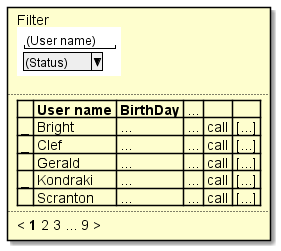

# FriendList
## Image

## User can (Overview)
- look the list of friend
  - filter (optional description)
  - sort (optional description)
- jump to friend detail page
- call a friend
- ...

## URL to this page
- [ ] `/ui/friends?`
  - [ ] status: friend status to filter
  - [ ] name: friend name to filter
  - [ ] ...

## UI objects
### Header
- [ ] HamburgerMenu: Button
- [ ] Avatar: Image

### FilterForm
- [ ] Status: Pulldown
  - [ ] Online
  - [ ] Offline
- [ ] Name: Textbox
  - [ ] maxLength: 20
- [ ] ...
- [ ] ApplyButton: Button

### FriendList
#### Header
- [ ] Check: Label
  - [ ] sortable: false
- [ ] Avatar: Label
  - [ ] sortable: false
- [ ] Buttons: Label
  - [ ] sortable: false
- [ ] *(same as body): Label
#### Body
- [ ] Check: Checkbox
- [ ] StatusIcon: Icon
- [ ] Avatar: Image
- [ ] UserName: Label
- [ ] Birthday: Label
  - [ ] format: "MM-DD"
- [ ] ...
- [ ] CallButton: Icon
  - enabled: status = Online
- [ ] MenuButton: Button

## Events
### Non user event
##### OnInit
###### Expectation
- FriendList
  - Header
    - [ ] Sorting: name, asc
  - Body
    - [ ] ...
    - [ ] CallButton: enabled if online
    - [ ] ...
  - [ ] Page: 1

###### Procedure
- assain from URL params
  - [ ] FilterForm.Status: status
  - [ ] FilterForm.Name: name
  - [ ] ...
- [ ] repuest `GetMe`
  - [ ] params: none
  - [ ] (OK) show `HeaderArea.Avatar`
  - (Err)
    - [ ] show error dialog
    - [ ] break
- [ ] request `GetFriends`
  - params
    - [ ] staus: FilterForm.Status
    - [ ] name: FilterForm.Name
    - [ ] ...
  - (OK) show result on `FriendList`
    - [ ] .Status: status
    - [ ] .Avatar: avatar_url
    - [ ] .Name: name
    - [ ] ...
  - (Err)
    - [ ] show error dialog
    - [ ] break
- etc expectation
  - [ ] UserList sorting: UserName, Ascending

### Header
#### HamburgerMenu
##### click
###### Expectation
- [ ] SideMenu: visible

###### Procedure
- [ ] show `SideMenu`

#### Avatar
##### click
###### Expectation
- [ ] ActionPopup: visible

###### Procedure
- [ ] show `AccountPopup`

##### hover
###### Expectation
- [ ] ToolTip: user name

###### Procedure
- [ ] show user name

### FilterForm
...

### FriendList.Header
#### (each column)
##### click
###### Expectation
- sort ...

###### Procedure
- ...

### FriendList.Body
#### CallButton
##### click
###### Expectation
- CallingPopup: visible

###### Procedure
- ...

## Dependencies
### API
- [GetMe](link/to/get-me/spec)
- [GetFriends](link/to/get-friends/spec)

### Permission
- Camera

### Page
- FriendDetailPage
